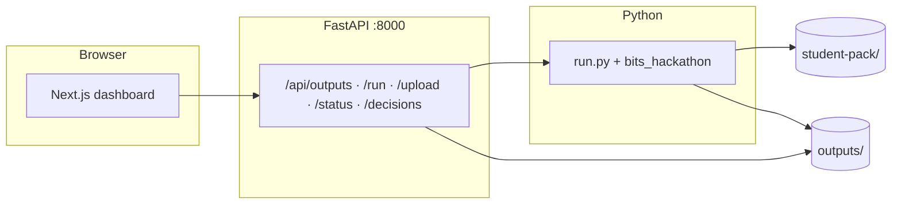
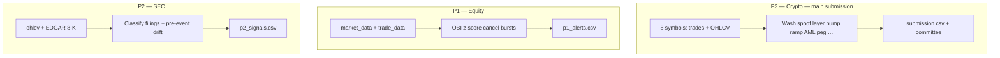
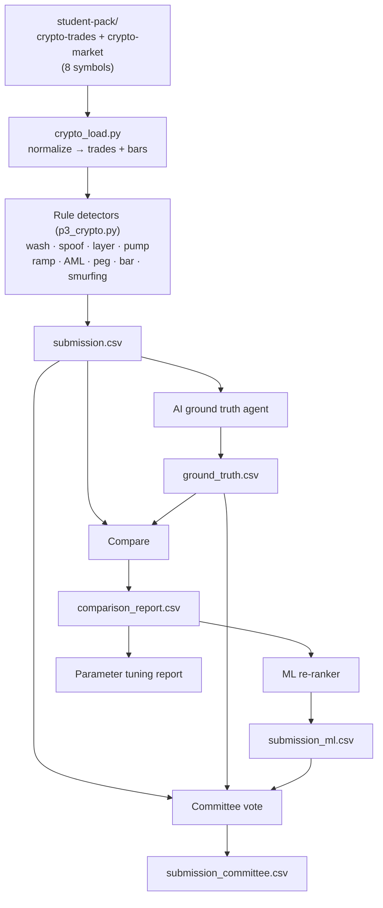

# Trade Surveillance Platform

**BITS Hackathon 2026** — Rule-based + AI + ML **committee** fusion for crypto trade surveillance (P3), with bonus **equity order-book** (P1) and **SEC 8-K / pre-announcement drift** (P2). **Next.js** UI + **FastAPI** API; optional **Streamlit** `app.py`.

---

## How it fits together



---

## Three problem tracks



---

## Crypto pipeline (rules → AI → ML → committee)



**Committee idea:** rows where **2+** of {rules, AI, ML} agree enter **Tier 1**, then optional **ML probability** and **AI confidence gates** trim weak coincidences (`config.yaml` → `committee.tier1_*`). Rules-only rows need **higher GT confidence** than before. Tune in `committee` and `p3` sections.

---

## Quick start

| Step | Command |
|------|---------|
| Python venv | `python3 -m venv .venv && source .venv/bin/activate` |
| Deps | `pip install -r requirements.txt` |
| Secrets | Create `.env` with `OPENROUTER_API_KEY=...` (optional for rules-only) |
| Data | `student-pack/` with `crypto-*`, `equity/*` (see repo) |
| Run all | `python3 run.py all` |
| P3 rules only | `python3 run.py p3` → `outputs/submission.csv` |
| Ground truth + compare | `python3 run.py ground-truth` then `python3 run.py compare` |
| Score proxy (tuning) | `python3 run.py score-proxy` — **5·TP − 2·FP** vs `outputs/ground_truth.csv` (proxy only) |
| ML baseline | `python3 run.py ml-baseline` → `outputs/ml_baseline_report.txt` |
| Train staged ML | `python3 run.py train-ml` → refreshes `comparison_report.csv`, then `artifacts/*.joblib`, `outputs/submission_ml.csv` |
| Infer ML only | `python3 run.py infer-ml` (requires trained artifacts) |
| Committee final | `python3 run.py committee` → `outputs/submission_committee.csv` |
| **Judge: root CSV** | `python3 run.py export-submission --source committee` → copies chosen file to **`submission.csv` at repo root** (add `--also-p1` / `--also-p2` for bonus artifacts) |
| Refresh dashboard static JSON | `python3 scripts/sync_frontend_data.py` (after train-ml / committee; updates `frontend/public/data/` including `ml_health.json`) |
| API | `uvicorn api.main:app --reload --port 8000` |
| UI | `cd frontend && npm install && npm run dev` → [http://localhost:3000](http://localhost:3000) |

**P2 empty UI?** Run `python3 run.py p2` with internet (SEC). Pre-built **outputs/** are committed; re-run pipelines to refresh.

---

## Judges & submission checklist (P3 + bonus)

1. **Reproduce** (from repo root, with `student-pack/` present):
   - `python3 run.py p3`
   - Optional full stack: `python3 run.py ground-truth` → `python3 run.py compare` → `python3 run.py train-ml` → `python3 run.py committee`
2. **Scored file:** organisers expect **`submission.csv` at the repository root**. This repo’s pipeline writes primary CSVs under **`outputs/`**; run:
   - `python3 run.py export-submission --source committee` (recommended final artefact), or `--source rules` / `--source ml`.
   - Bonus: `python3 run.py export-submission --source committee --also-p1 --also-p2` to also place `p1_alerts.csv` and `p2_signals.csv` at the root.
3. **README / approach:** keep this file accurate; borderline grading may reference your stated method and thresholds (`config.yaml`).
4. **Runtime:** note wall-clock for `run.py p3` on a clean machine if you document performance.
5. **Score proxy (internal):** `python3 run.py score-proxy` compares `outputs/submission.csv` to **`verdict == suspicious`** in `ground_truth.csv` — useful for tuning, **not** the official hackathon grader.

**P3 rule hardening (high level):** wash uses **ordered** same-wallet pairing (forward/backward `merge_asof`), **min notional** floors (higher on BTC/ETH), **ramping** requires tight **median inter-trade gap**, **layering_echo** requires **balanced** buy/sell notional, **coordinated_structuring** requires **similar wallet-level sizes**, **spoofing** uses **stricter bps** on **low-tradecount** bars, **USDC peg** requires **min trade size + bar volume**, **BAT** spike hours need **material tradecount**.

---

## Dashboard (sidebar)

| Page | What you get |
|------|----------------|
| P3 / P1 / P2 | Tables, charts, filters; P3: Rules vs **Committee** |
| Committee / Comparison | Zones, ML text, agree vs disagree |
| Pipeline | **Run** each step, CSV upload, file status |
| Workflow | **React Flow** mind map (click nodes) |
| Knowledge | Short lessons + regs (like a mini glossary) |
| Audit | HITL JSONL via API |

Theme: **Light / Dark / System** (sidebar footer). Optional: `NEXT_PUBLIC_API_URL` in `frontend/.env.local`.

---

## Repo layout (short)

```
bits_hackathon/   # core, detectors (p1, p2, p3), pipeline (ml_stage1/2, labels, evaluate, committee, …)
artifacts/        # trained .joblib models (gitignored); keep `.gitkeep`
api/              # FastAPI routes
frontend/         # Next.js 16 App Router
run.py            # CLI: p1 p2 p3 ground-truth compare train-ml committee score-proxy export-submission …
config.yaml       # Thresholds + committee
docs/finance-glossary.md   # Long glossary & regulatory notes
```

---

## Config & env

- **`config.yaml`** — `p3.*` detectors, `committee.*` AI-only thresholds.
- **`.env`** — `OPENROUTER_API_KEY` (not committed).
- **`frontend/.env.local`** — optional `NEXT_PUBLIC_API_URL`.

---

## Learn more (long text moved out of README)

- **Definitions & regulations (full prose):** [`docs/finance-glossary.md`](docs/finance-glossary.md)
- **Same topics, interactive:** run the app and open **Knowledge Base** (`/knowledge`).

---

## License

BITS Hackathon 2026 — Academic project.
