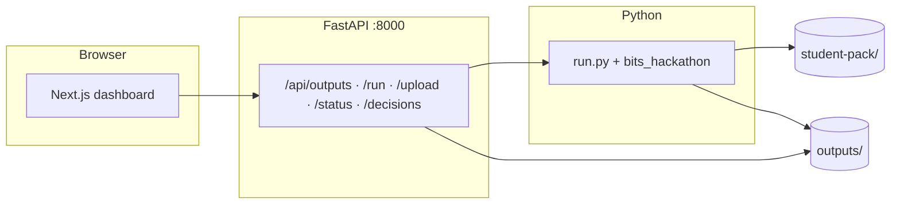
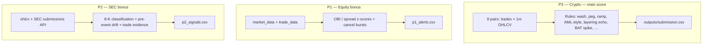
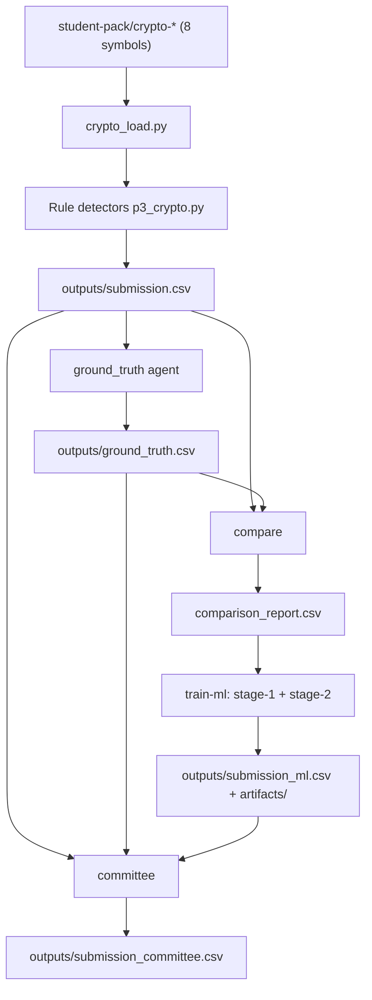

# Trade Surveillance Platform

**BITS Hackathon 2026** — Crypto trade surveillance (**Problem 3**, required) with **rule-based detectors**, optional **AI ground-truth** labelling, **staged ML** (suspicion + violation type), and **committee fusion**. Bonus: **equity order-book alerts** (P1) and **SEC 8-K / pre-announcement drift** (P2). **Next.js** dashboard + **FastAPI** backend; optional Streamlit `app.py`.

---

## What we submit (judges)

| Deliverable | Where it comes from |
|-------------|---------------------|
| **`submission.csv`** (repo root) | Run `python3 run.py export-submission` after generating outputs (see below). |
| **Mirror copy** | Same content is written to **`submissions.csv`** at repo root (duplicate for convenience). |
| **Default export** | **`--source rules`** → `outputs/submission.csv` from **`python3 run.py p3`** (precision-first). Use **`--source committee`** or **`--source ml`** only if you validate net score on your side. |
| **Bonus** | `p1_alerts.csv`, `p2_signals.csv` — use `export-submission --also-p1 --also-p2` to copy them to repo root. |

**Problem 3 columns:** `symbol`, `date`, `trade_id`, `violation_type`, `remarks`.  
**Violation types** use the organiser’s **exact strings** (case-sensitive). Aliases from LLM/legacy code are normalised via `bits_hackathon/core/violation_taxonomy.py` before export.

---

## How it fits together



---

## Three problem tracks



---

## P3 pipeline (rules → optional AI → ML → committee)



- **Rules** implement behavioural patterns (wash, ramping, peg break, structuring bands, etc.), merge with priority, optional **trim** caps in `config.yaml`.
- **Ground truth** can run as **vectorized stub** (fast) or **LLM** if `OPENROUTER_API_KEY` is set (`ground-truth --stub-only` forces stub).
- **ML** uses shared features (`ml_features.py`), **stage-1** calibrated suspicion, **stage-2** multiclass type when data allows.
- **Committee** fuses rules + AI suspicious + ML flags; **`include_ai_only: false`** by default in `config.yaml` so **AI-only** rows are not promoted unless you turn that on (reduces false positives).

---

## Quick start

| Step | Command |
|------|---------|
| Python venv | `python3 -m venv .venv && source .venv/bin/activate` |
| Deps | `pip install -r requirements.txt` |
| Secrets | `.env` with `OPENROUTER_API_KEY=...` (optional; stub GT works without it) |
| Data | `student-pack/` with `crypto-*`, `equity/*` |
| **One-shot full pipeline** | `python3 run.py full-pipeline` — P3, P1, P2, stub GT, compare, **train-ml**, baseline, tune, committee, score-proxy (use `--with-llm` for slow LLM ground truth) |
| P3 rules only | `python3 run.py p3` → `outputs/submission.csv` |
| P1 / P2 | `python3 run.py p1` · `python3 run.py p2` |
| Ground truth | `python3 run.py ground-truth` or `python3 run.py ground-truth --stub-only` |
| Compare | `python3 run.py compare` |
| Score proxy (dev) | `python3 run.py score-proxy` — compares submission to `ground_truth.csv` **suspicious** rows (not official grader) |
| Train ML | `python3 run.py train-ml` |
| Committee | `python3 run.py committee` |
| **Publish judge CSV** | `python3 run.py export-submission` (defaults **rules**; optional `--source committee` / `ml`; `--also-p1` `--also-p2`) |
| Frontend data sync | `python3 scripts/sync_frontend_data.py` after pipeline runs |
| API | `uvicorn api.main:app --reload --port 8000` |
| UI | `cd frontend && npm install && npm run dev` → [http://localhost:3000](http://localhost:3000) |

Use **`python3`** or **`python`** depending on your environment. From the **repository root**:

```bash
python3 run.py              # print help (lists all subcommands)
```

---

## CLI reference — all `run.py` commands

| Command | What it does | Main output(s) under `outputs/` (unless noted) |
|--------|----------------|--------------------------------------------------|
| `p3` | P3 rule-based detectors on `student-pack` crypto data | `submission.csv` |
| `p1` | P1 equity order-book + cancel-pattern alerts | `p1_alerts.csv` |
| `p2` | P2 SEC 8-K + pre-event drift (needs network) | `p2_signals.csv` |
| `all` | Runs **`p3` → `p1` → `p2`** in sequence | same as above |
| `ground-truth` | AI / stub labels for every trade (LLM if `OPENROUTER_API_KEY` set) | `ground_truth.csv` |
| `ground-truth --stub-only` | Fast vectorized stub only; no LLM | `ground_truth.csv` |
| `compare` | Rules submission vs `ground_truth.csv` | `comparison_report.csv` |
| `train-ml` | Train stage-1 + stage-2 ML, evaluate, write models | `submission_ml.csv`, `training_snapshot.csv`, `ml_evaluation_report.txt`, `reranker_report.txt`; **`artifacts/*.json`** (`.joblib` gitignored) |
| `infer-ml` | Score with **saved** artifacts only (no training) | `submission_ml.csv` |
| `reranker` | Alternate ML path (legacy single pipeline) | `submission_ml.csv`, `reranker_report.txt` |
| `ml-baseline` | Summary of rules vs GT vs ML vs committee | `ml_baseline_report.txt` |
| `tune` | Heuristic threshold suggestions from comparison / tuning inputs | `tuning_report.txt` |
| `committee` | Fuse rules + `ground_truth` (suspicious) + `submission_ml` | `submission_committee.csv`, `committee_report.txt` |
| `full-pipeline` | **`p3` → `p1` → `p2` → ground-truth → `compare` → `train-ml` → `ml-baseline` → `tune` → `committee` → score-proxy×2** | refreshes all of the above |
| `full-pipeline --with-llm` | Same, but ground-truth uses LLM if API key present (slow) | same |
| `full-pipeline --stub-only` | Force stub ground truth inside full-pipeline | same |
| `score-proxy` | Dev metric: **5·TP − 2·FP** (+ optional type bonus) vs `ground_truth` suspicious | prints to stdout |
| `score-proxy --submission PATH` | Custom submission CSV | |
| `score-proxy --ground-truth PATH` | Custom GT CSV | |
| `score-proxy --no-type-bonus` | Base score only | |
| `score-proxy --json` | Machine-readable summary | |
| `export-submission` | Copy pipeline output to **repo root** `submission.csv` **and** `submissions.csv` | root CSVs |
| `export-submission --source rules` | Source: `outputs/submission.csv` (default) | |
| `export-submission --source committee` | Source: `outputs/submission_committee.csv` | |
| `export-submission --source ml` | Source: `outputs/submission_ml.csv` | |
| `export-submission --also-p1` | Also copy `p1_alerts.csv` to repo root | |
| `export-submission --also-p2` | Also copy `p2_signals.csv` to repo root | |

**Typical dependency order for P3 extras:** `p3` → `ground-truth` → `compare` → `train-ml` → `committee` → `export-submission`.

**Other scripts (not `run.py`):**

| Command | Purpose |
|--------|---------|
| `python3 scripts/sync_frontend_data.py` | Refresh `frontend/public/data/*.json` from `outputs/` for the Next.js UI offline fallback |
| `uvicorn api.main:app --reload --port 8000` | FastAPI backend (serves outputs, can trigger `run.py` routes) |

---

## Configuration

- **`config.yaml`** — P3 detector thresholds (`p3.*`), P1/P2, **committee** gates, **ML** training knobs. Env overrides: `CFG_*` (see `bits_hackathon/core/config.py`).
- **`.env`** — `OPENROUTER_API_KEY` (not committed).
- **`frontend/.env.local`** — optional `NEXT_PUBLIC_API_URL`.

---

## Repo layout

```
bits_hackathon/     # core, detectors (p1, p2, p3), pipeline (ML, committee, labels, …)
bits_hackathon/core/violation_taxonomy.py   # official P3 violation_type strings + normalisation
artifacts/          # trained .joblib (often gitignored)
api/                # FastAPI
frontend/           # Next.js App Router
run.py              # CLI: p3, p1, p2, full-pipeline, ground-truth, compare, train-ml, committee, score-proxy, export-submission, …
config.yaml
student-pack/       # Distributed data (paths expected by loaders)
docs/finance-glossary.md
```

---

## Dashboard (sidebar)

| Page | Purpose |
|------|---------|
| P3 / P1 / P2 | Tables and charts; P3: rules vs committee views |
| Committee / Comparison | Agreement zones and diffs |
| Pipeline | Trigger runs, upload CSV, status |
| Workflow | React Flow overview |
| Knowledge | Short notes + glossary links |
| Audit | HITL decisions via API |

Theme: Light / Dark / System.

---

## Further reading

- Long-form definitions: [`docs/finance-glossary.md`](docs/finance-glossary.md)

---

## Licence

BITS Hackathon 2026 — academic / competition use.
